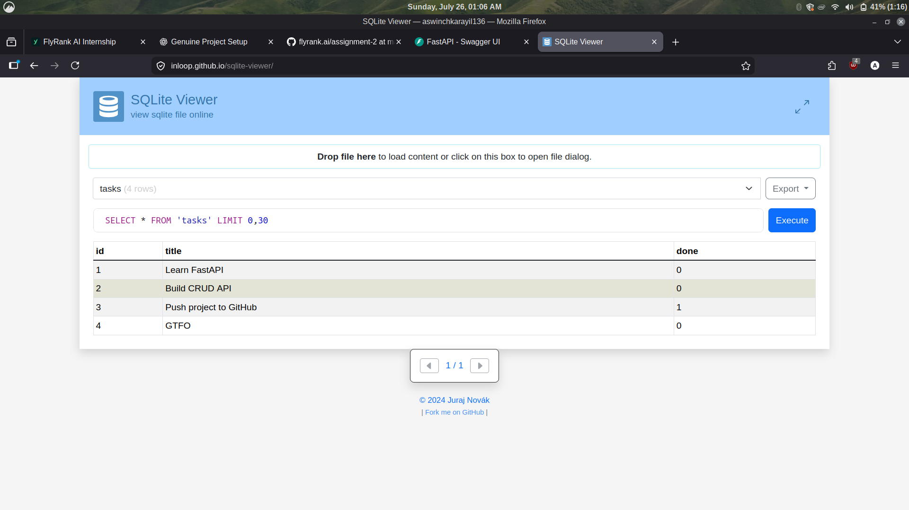

# Assignment 2 - Task API with SQLite Persistence

A RESTful Task Management API built with **FastAPI** and **SQLite**. This API provides full CRUD (Create, Read, Update, Delete) functionality for task management, persisting all data across server restarts.

---

## 🚀 Features

- **SQLite Persistence**: Replaces in-memory storage; data survives server restarts.
- **Auto-Initialization**: Database directory and `tasks` table are automatically created on server start if missing.
- **First-Run Seeding**: Automatically seeds three initial tasks (`Learn FastAPI`, `Build CRUD API`, `Push project to GitHub`) only on the first run.
- **Pure SQL Queries**: All database operations use explicit SQL queries.
- **Error Handling**: 
  - `404 Not Found` for non-existent task IDs.
  - `400 Bad Request` / `422 Unprocessable Entity` for invalid payloads or missing fields.

---

## 🛠️ Setup & Installation

Follow these exact steps to set up the environment and run the project locally.

### 1. Navigate to the Assignment Directory
```bash
cd assignment-2
```

### 2. Create and Activate Virtual Environment (`venv`)
```bash
# Create virtual environment
python3 -m venv .venv

# Activate virtual environment
source .venv/bin/activate
```

### 3. Install Dependencies
```bash
pip install -r requirements.txt
```

---

## 🏃 Running the Server

Start the API server locally using Uvicorn:

```bash
uvicorn main:app --reload
```

The server will run at: `http://127.0.0.1:8000`

Interactive Swagger Documentation is available at:
👉 **`http://127.0.0.1:8000/docs`**

---

## 📁 Project Structure

```text
assignment-2/
│
├── main.py              # FastAPI application with endpoints & SQLite operations
├── requirements.txt     # Python project dependencies
├── database/            # SQLite database folder (auto-generated)
│   └── tasks.db         # SQLite database file
├── images/              # Screenshot assets
│   └── db_screenshot.png # Database inspection screenshot
└── README.md            # Assignment documentation
```

---

## 📌 API Endpoints

| Method | Endpoint | Description | Status Code |
| :--- | :--- | :--- | :--- |
| `GET` | `/` | API Root / Info | `200 OK` |
| `GET` | `/health` | Health Check | `200 OK` |
| `GET` | `/tasks` | Retrieve all tasks | `200 OK` |
| `GET` | `/tasks/{id}` | Retrieve a specific task by ID | `200 OK` / `404 Not Found` |
| `POST` | `/tasks` | Create a new task | `201 Created` / `422 Unprocessable Entity` |
| `PUT` | `/tasks/{id}` | Update an existing task's title or status | `200 OK` / `404 Not Found` |
| `DELETE` | `/tasks/{id}` | Delete a task by ID | `200 OK` / `404 Not Found` |

---

## 📸 Database Verification Screenshot



*(Note: Save your screenshot to `images/db_screenshot.png` showing your SQLite DB browser / CLI query of the `tasks` table).*
